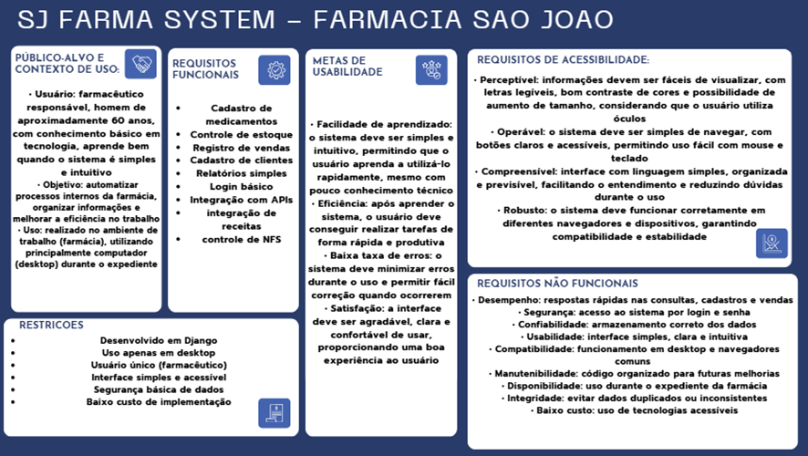
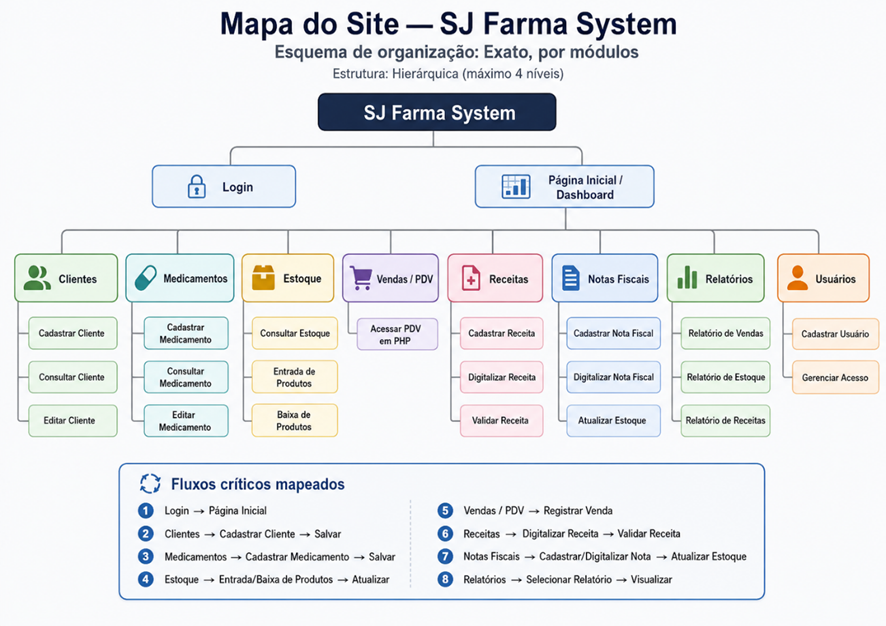
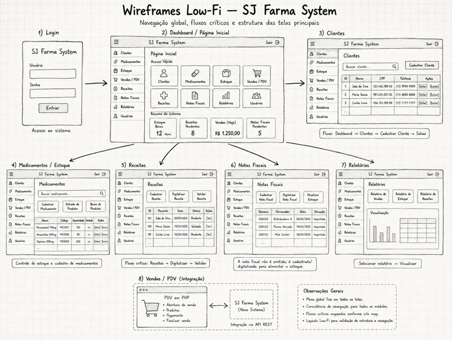
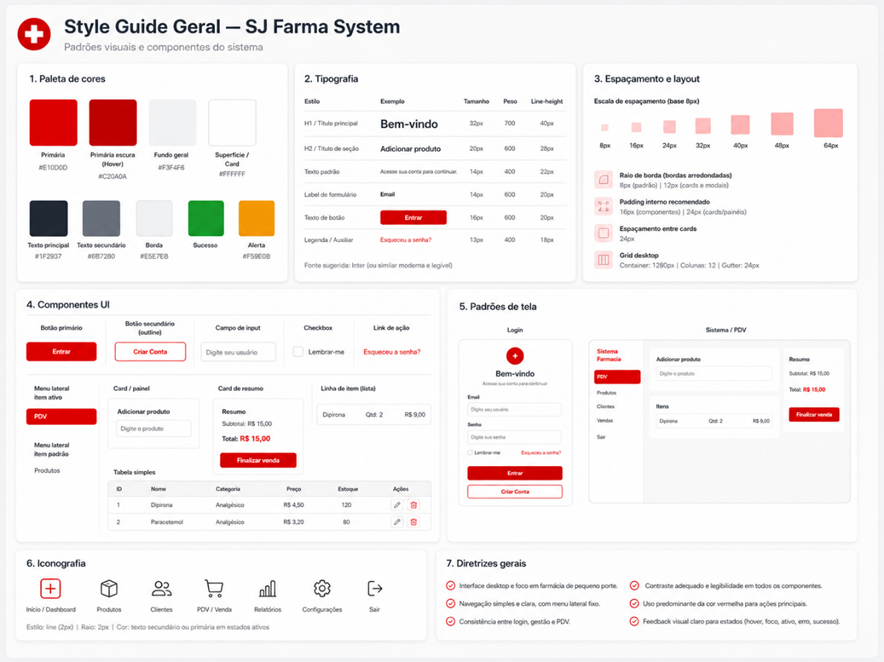

## Diagrama de Caso de Uso

## Diagrama de Contexto

---

## Requisitos de IHC – Canvas

# Detalhamento do Canvas 

## Público-alvo e contexto de uso

O sistema será utilizado principalmente por atendentes e farmacêuticos de uma farmácia de pequeno porte.

O uso ocorrerá em ambiente interno, durante o expediente, em computador desktop. Como os usuários podem ter apenas conhecimento básico de tecnologia, a interface deve ser simples, clara e objetiva.

---

## Objetivo do sistema

O objetivo do sistema é reformular um sistema antigo feito em PHP, mantendo o PDV em PHP e migrando os demais módulos para Django.

O novo sistema utilizará MongoDB como banco de dados e se comunicará com o PDV por meio de uma API REST Framework.

---

## Requisitos funcionais

* Login e logoff.
* Cadastro de medicamentos.
* Controle de estoque.
* Registro de vendas.
* Cadastro e gerenciamento de clientes.
* Cadastro e digitalização de notas fiscais.
* Atualização de estoque com base nas notas fiscais.
* Cadastro de receitas médicas.
* Validação de receitas.
* Geração de relatórios simples.
* Comunicação entre o PDV em PHP e o sistema Django por API REST.

---

## Metas de usabilidade

O sistema deve ser fácil de aprender, permitindo que o atendente realize tarefas básicas rapidamente.

A interface deve ser eficiente para cadastro, venda e consulta de estoque. Também deve ser fácil de lembrar, mesmo após um período sem uso.

Além disso, o sistema deve reduzir erros em vendas, controle de estoque, notas fiscais e receitas médicas, proporcionando uma experiência de uso organizada e agradável.

---

## Requisitos de acessibilidade — POUR

### Perceptível

Os textos devem ser legíveis, com contraste adequado entre fundo e conteúdo. Botões, campos e informações importantes devem estar visíveis e bem organizados.

### Operável

A navegação deve ser simples, permitindo o uso por mouse e teclado. As ações principais devem ser fáceis de localizar e executar.

### Compreensível

A interface deve utilizar linguagem clara, telas organizadas e mensagens objetivas, facilitando o entendimento das funções do sistema.

### Robusto

A interface deve ser compatível com navegadores comuns e construída com HTML/CSS semântico, facilitando manutenção e acessibilidade.

---

## Requisitos não funcionais

* Bom desempenho em consultas, cadastros e vendas.
* Segurança no login.
* Armazenamento confiável dos dados.
* Interface clara e intuitiva.
* Compatibilidade com navegadores desktop.
* Código organizado para facilitar manutenção.
* Disponibilidade durante o expediente da farmácia.
* Integridade dos dados cadastrados.
* Baixo custo de implementação.

---

## Restrições do projeto

O sistema deve ser desenvolvido em Django, utilizando MongoDB por exigência da faculdade.

O PDV permanecerá em PHP, e a comunicação entre os sistemas será feita por API REST.

O sistema será voltado para uso em desktop. A funcionalidade de nota fiscal não terá emissão, apenas cadastro e digitalização para auxiliar no preenchimento e atualização do estoque.

Por se tratar de uma farmácia de pequeno porte, o projeto deve manter uma estrutura simples e objetiva.

---

## Testes previstos

* Teste de login e logoff.
* Teste de cadastro de medicamentos.
* Teste de controle de estoque.
* Teste de registro de vendas.
* Teste de cadastro e gerenciamento de clientes.
* Teste de cadastro de receitas médicas.
* Teste de validação de receitas.
* Teste de cadastro e digitalização de notas fiscais.
* Teste de integração entre PHP e Django por API REST.
* Teste de usabilidade da interface reformulada.

## Mapa do site 

## Wireframe Low-Fi

## Style Guide Geral 

