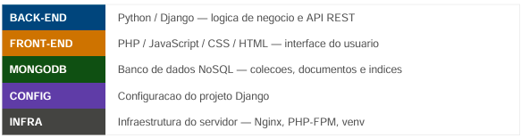

# SJ System — Diagrama do Banco de Dados
## (MongoDB)

# Estrutura de Pastas, Arquivos e Banco de Dados

## Este documento descreve cada pasta e arquivo do projeto SJ System, indicando sua camada (back-end,front-end ou banco de dados), sua funcao e como se relaciona com os demais componentes

