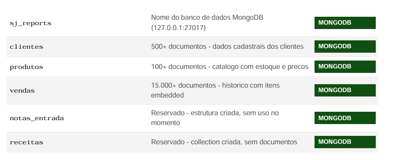
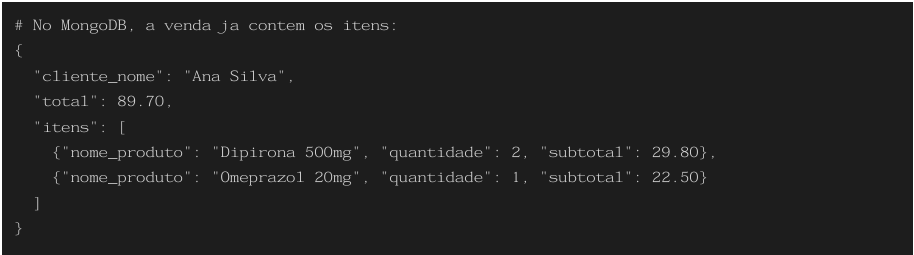

# SJ System — Diagrama do Banco de Dados
## (MongoDB)

 # Banco de Dados — MongoDB (sj_reports)

 ## O MongoDB e um banco NoSQL orientado a documentos. Nao ha tabelas - existem collections de documentos JSON. O banco roda localmente e e acessado apenas pelo Django (nunca pelo front-end diretamente)

 

## Por que MongoDB e nao SQL?
 ### Os itens de uma venda sao naturalmente um array dentro do documento da venda (embedded documents). Isso evita JOINs e permite buscar uma venda completa em uma unica query.

 

