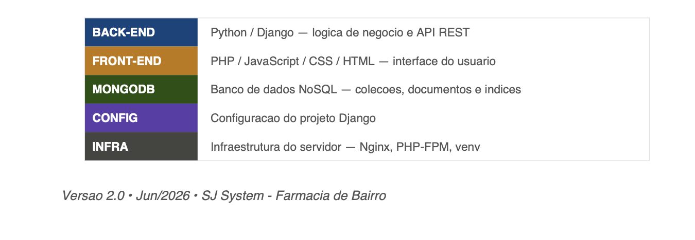
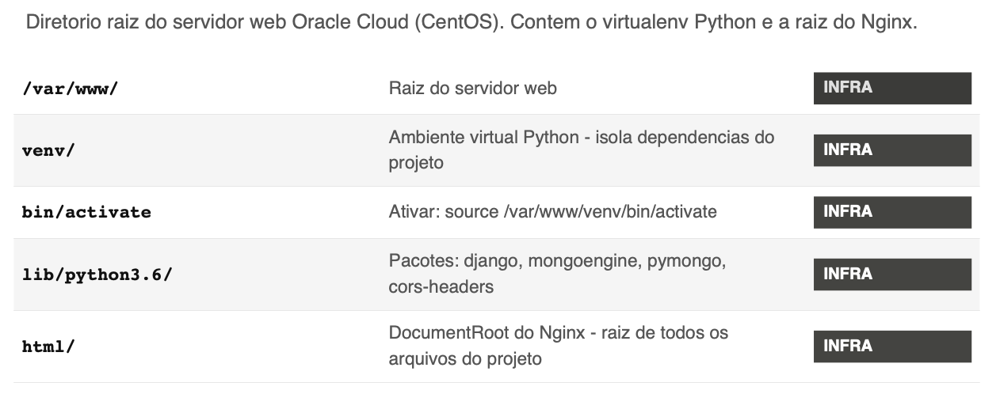
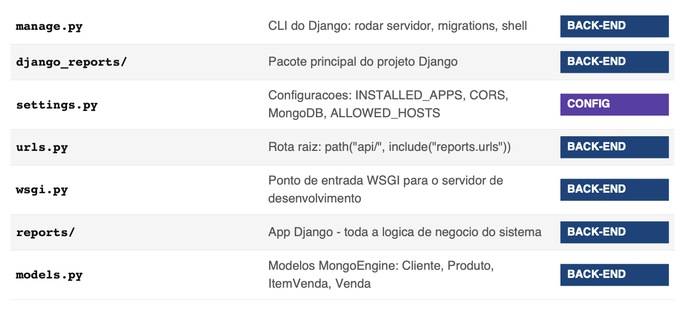
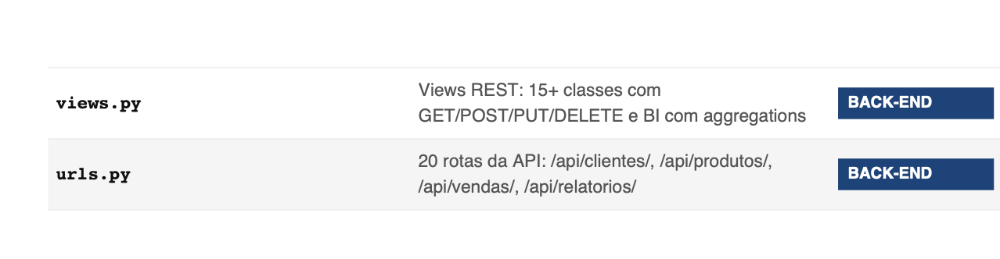
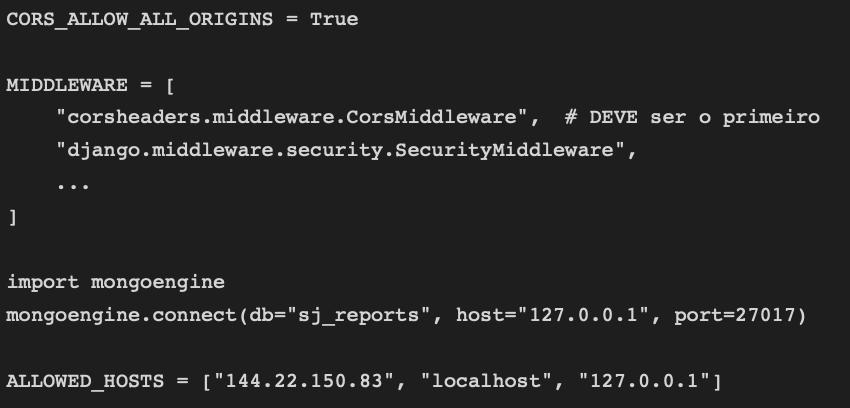
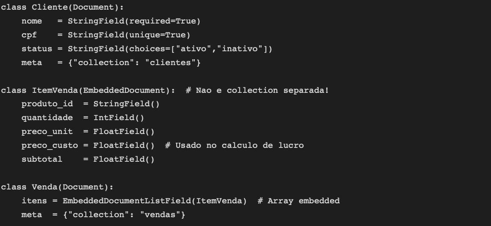
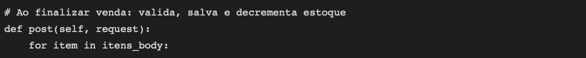

## SJ System
#### Documentacao de Estrutura de Pastas, Arquivos e Banco de Dados

Este documento descreve cada pasta e arquivo do projeto SJ System, indicando sua camada (back-end, front-end ou banco de dados), sua funcao e como se relaciona com os demais componentes.

## Raizes do Servidor - /var/www/

### Por que o venv e importante?
O servidor usa Python 3.6.8 do sistema. O venv garante que as versoes corretas das bibliotecas sejam usadas sem interferir em outros projetos. Sempre ativar antes de rodar o Django.

### Back-end Django — /var/www/html/

API REST construida com Django 3.2. Nao serve HTML - apenas recebe requisicoes HTTP do front-end e retorna JSON. Usa MongoEngine como ODM e pymongo para as aggregation pipelines dos relatorios.

###  settings.py — configuracoes criticas
Controla todo o comportamento do Django. Pontos mais importantes:

###  models.py — estrutura dos documentos
Define os documentos MongoDB. Cada classe vira uma collection no banco. ItemVenda e um EmbeddedDocument - nao tem collection propria, fica dentro de Venda.

###  views.py — logica de negocio

Contem todas as views REST. Os relatorios usam pymongo direto para as aggregation pipelines. Ao finalizar uma venda, o Django valida estoque, salva a venda e decrementa o estoque automaticamente.

